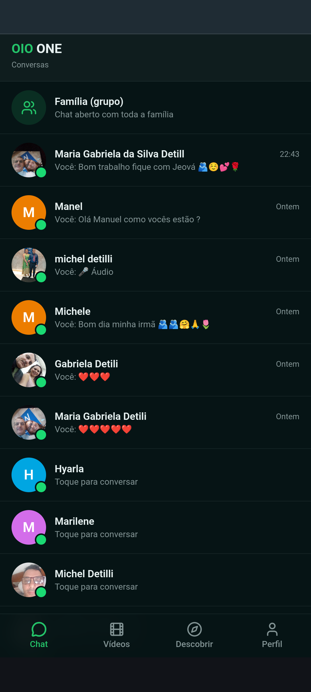
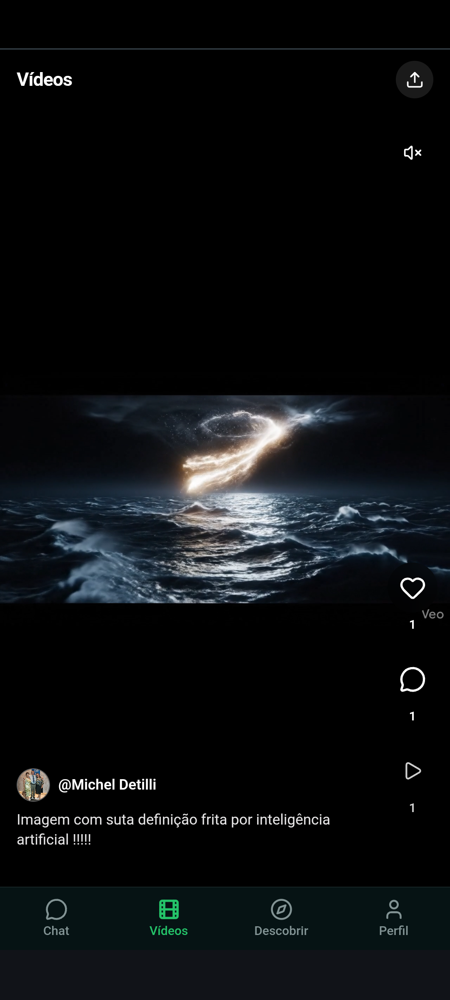
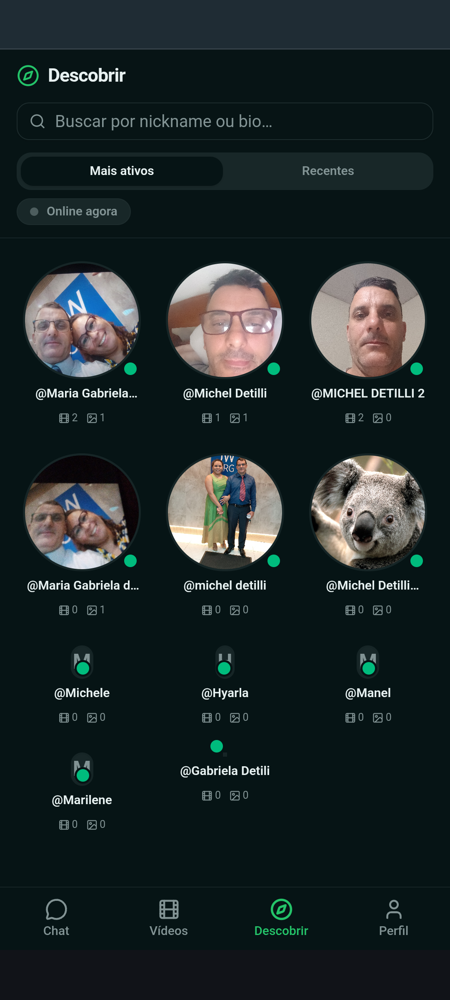
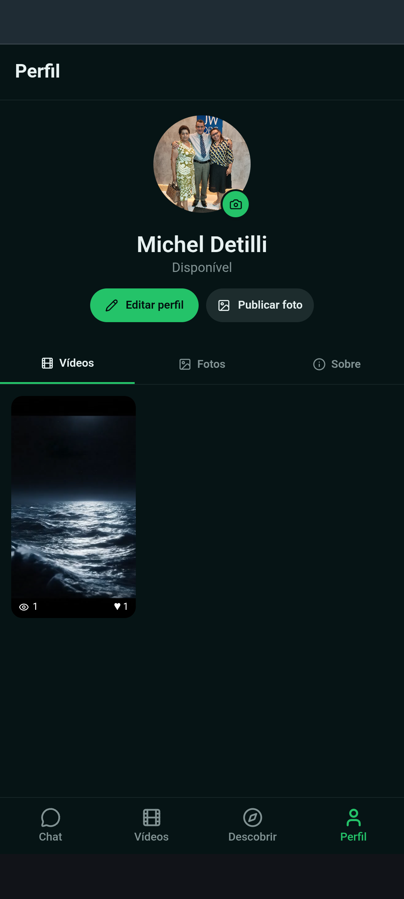

<h1 align="center">🚀 OIO ONE & Vibe-app</h1>

  
  
  
  

<h3 align="center">O seu pensamento é o único limite. O design de luxo não.</h3>

Plataforma SaaS com arquitetura modular, comunicações em tempo real e interface Orbital.

  🚀 <b><a href="https://oio-fam.vercel.app">Ver Demo</a></b> &nbsp;•&nbsp;
  💬 <b><a href="https://wa.me/5511974790494">WhatsApp</a></b> &nbsp;•&nbsp;
  📧 <b><a href="mailto:detiillimichel@gmail.com">Email</a></b>

 

<table align="center" style="border: none;">
  <tr style="border: none;">
    <td align="center" style="border: none; vertical-align: top;">
       
       <b>Chat em tempo real com fotos e áudios</b>
    </td>
    <td align="center" style="border: none; vertical-align: top;">
       
       <b>Vídeos</b>
    </td>
    <td align="center" style="border: none; vertical-align: top;">
       
       <b>Descobrir</b>
    </td>
    <td align="center" style="border: none; vertical-align: top;">
       
       <b>Perfil</b>
    </td>
  </tr>
</table>

 

<h2 align="center">💼 Como funciona o Aluguel (SaaS)?</h2>

  Os meus sistemas são comercializados sob licença. Você não precisa de lidar com códigos ou configurações complexas: eu entrego o sistema rodando na nuvem, pronto para o seu uso corporativo, com segurança e manutenção garantidas. O acesso é exclusivo e gerenciado por assinatura.

